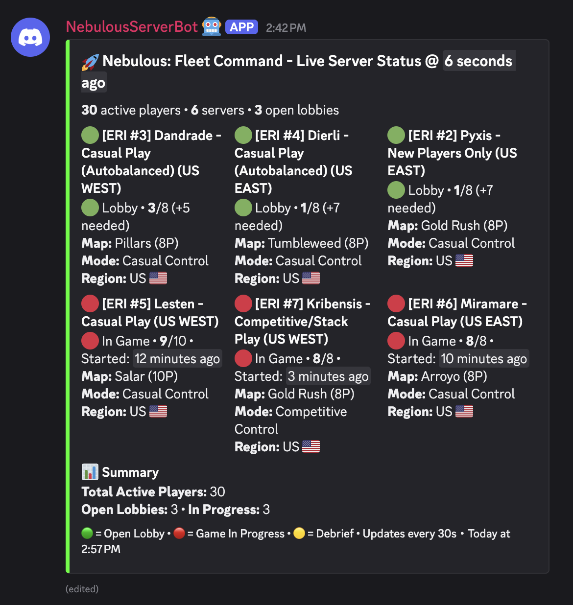
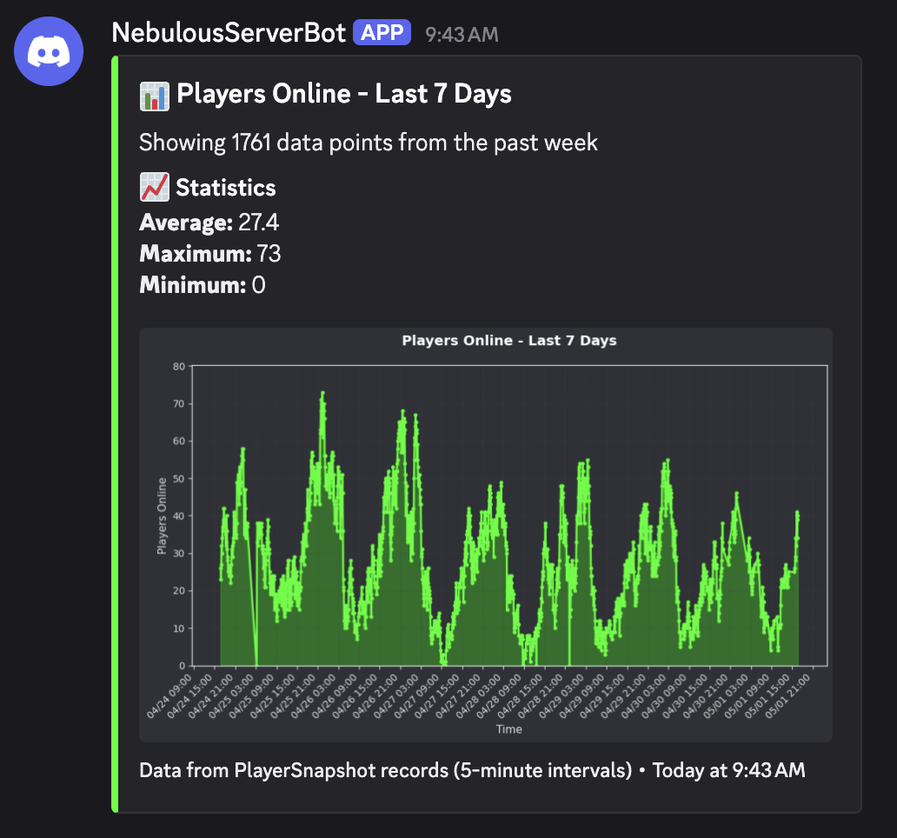
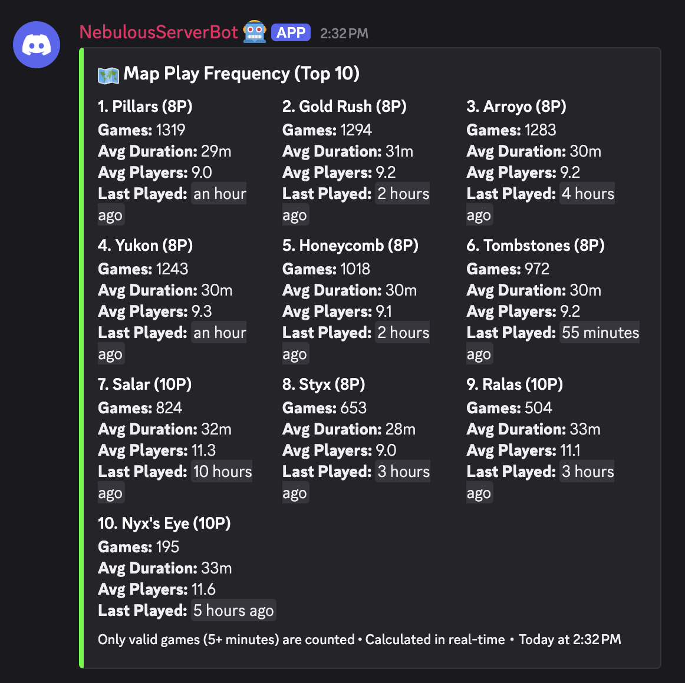

# Nebulous: Fleet Command — Discord Bot

[](https://github.com/MatthewARoy/NebulousServerDiscordBot/actions/workflows/ci.yml)
[](LICENSE)
[](https://www.python.org/downloads/)

A Discord bot that surfaces live multiplayer server activity for
[**Nebulous: Fleet Command**](https://store.steampowered.com/app/887570/),
the indie space-RTS by Eridanus Industries. The bot polls the Steam Web API,
maintains a live-updating status embed in any Discord guild that adds it,
and provides commands for finding open lobbies, tracking game statistics
over time, getting pinged when the next game is ready, and even optimizing
fleet `.fleet` files.

It runs the production deployment for the Nebulous community on Oracle
Cloud's Always Free tier.

> **Status:** active. Open source under MIT — built and maintained as a
> portfolio / showcase project. There is no hosted public instance; self-host
> in ~15 minutes via the [Quickstart](#quickstart).

## What it looks like

**Live server status** — pinned in your channel, refreshes every 30 seconds:



**`!graph players online`** — 7-day activity at a glance:



**`!mapstats`** — most-played maps with averages:




## Highlights

- **Live multi-server status.** A pinned embed updates every 30 seconds with
  active servers, player counts, maps, and game modes — across any Discord
  guild that adds the bot.
- **Self-service per-guild setup.** Admins of any guild that adds the bot
  pick the channel for the live status with `!setstatuschannel`. No
  redeploy needed.
- **Self-refreshing command output.** When someone runs `!listservers` or
  `!openlobbies`, the response message keeps refreshing in place. The last
  10 messages per channel stay current so people don't spam the command.
- **`!nextgame` waitlist.** Opt in to a one-shot ping when a lobby reaches
  3+ players or a game enters debrief. Supports PTB-only mode and "skip
  current lobbies".
- **Real statistics.** Every detected game (lobby → in-game ≥5 min →
  debrief) is persisted with map, duration, server, and player count.
  `!stats`, `!mapstats`, `!serverstats`, and a 7-day `!graph` aggregate from
  that history.
- **Fleet formation optimizer.** `!formation` accepts a `.fleet` XML file
  and returns a compacted version (with planar / symmetrical / clear-arcs
  variants) plus an optional GIF of the optimization run.
- **Production setup, not a toy.** Django for ORM/migrations/admin, Gunicorn
  for a health endpoint, Docker for packaging, Oracle Cloud deploy script,
  GitHub Actions CI.

## What this bot is not

A single-purpose monitor for **Nebulous: Fleet Command**. It is not a
moderation bot, music bot, leveling bot, or a general-purpose Discord bot.

## Tech stack

Python 3.11 · Django 4.2 LTS · discord.py · SQLite · Docker · Oracle Cloud
(OCI Always Free).

## Repo layout

```
nebulous_bot/        the bot (Django app, entry point: management/commands/runbot.py)
formation_optimizer/ standalone fleet-formation library + tests
deployment/          Docker + Oracle Cloud deploy
docs/                full documentation
```

See [`docs/ARCHITECTURE.md`](docs/ARCHITECTURE.md) for a deeper map.

## Quickstart

### Prerequisites

- Python 3.11+
- A Discord application with a bot user (Discord Developer Portal). Make
  sure the **`bot` scope** is included in *Installation → Default Install
  Settings → Guild Install*, otherwise the install button silently fails.
- A Steam Web API key.

### Run it locally

```bash
git clone https://github.com/MatthewARoy/NebulousServerDiscordBot.git
cd NebulousServerDiscordBot
python -m venv .venv && source .venv/bin/activate
pip install -r requirements.txt
cp env_example.txt .env       # then fill in your tokens
python manage.py migrate
python manage.py runbot
```

Invite the bot to your Discord server using the Developer Portal's
OAuth2 URL Generator (scopes: `bot` + `applications.commands`; permissions:
View Channel, Send Messages, Embed Links, Read Message History,
Use External Emojis). Once it's in your server, an admin runs:

```
!setstatuschannel #channel-name
```

Full walkthrough: [`docs/QUICKSTART.md`](docs/QUICKSTART.md).

## Documentation

- [`docs/QUICKSTART.md`](docs/QUICKSTART.md) — local setup
- [`docs/CONFIGURATION.md`](docs/CONFIGURATION.md) — environment variables
- [`docs/COMMANDS.md`](docs/COMMANDS.md) — every Discord command
- [`docs/ARCHITECTURE.md`](docs/ARCHITECTURE.md) — how the pieces fit together
- [`docs/OPS.md`](docs/OPS.md) — production operations notes
- [`deployment/oracle/README.md`](deployment/oracle/README.md) — Oracle
  Cloud deploy
- [`CHANGELOG.md`](CHANGELOG.md) — release history

## Contributing

This is primarily a personal / showcase project, but issues and PRs are
welcome. For larger changes, please open an issue first to discuss the
direction.

## Author

Built by [Matthew Roy](https://github.com/MatthewARoy).

## Acknowledgements

Not affiliated with Eridanus Industries (the developers of Nebulous: Fleet
Command) or Valve. Built on publicly available APIs.

## License

[MIT](LICENSE).
