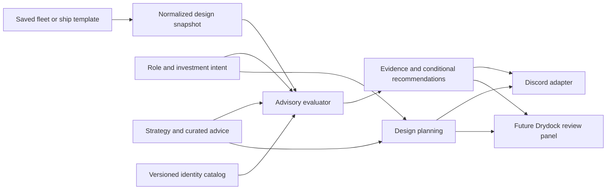

# Reusable shipbuilding strategy: engineering outline

Implemented 2026-09-12 as the independent `fleet_strategy` Python package,
data under `knowledge/strategy`, and a thin Discord adapter. This extends
the August structured-advice design without moving or duplicating its
canonical 47-entry corpus. Current production deployment is unchanged by
editing these files.

## Damage-ray follow-up implemented, 2026-10-01

`/fleetcheck` reviews an uploaded `.fleet` or `.ship`, with optional role and
threat/direction selections. A separately installed geometry dataset enables
conditional regional results and a narrow candidate search. Missing geometry
leaves protection unknown while ordinary fitting advice remains available.
`/shipbuilding`, `/guide`, command help and the attached fleet report contain
the user instructions. Mention/DM commands retain `fleetcheck`, `shipcheck`
and `shipbuilding`; plain server prefixes are not the production surface.

The explicit calculator remains available through
`--stack SHIP_KEY:SOCKET,SOCKET --threat hei --dr 0.2` in the command's
`options`. These keys describe an assumed hit collection, not a measured
stack. `evaluate_stack` and the standalone CLI use the same packet model.

`knowledge/strategy/damage.toml` pins eight threat profiles and eleven
component base thresholds to **0.6.2.6 public, Steam build 25104609**. It
includes asset hashes, code hashes and navigation references into the new
wiki audit. Its contents participate in the exported bundle hash. The
underlying code and serialized flags were rechecked; an audit claim ID or
historical wiki match is not treated as fresh combat validation.

| Profile | Packet before distribution | Distribution and DR |
|---|---:|---|
| Modular HEI maximum ray | 50 HP | Equal split; DR applies |
| 120 / 250 / 450 mm HE | 50 / 80 / 150 HP | One internal explosion, equal split; DR applies |
| 450 mm AP | 100 HP | First non-destroyed recipient; DR applies |
| 300 mm rail sabot | 80 HP pool | 40, 20, 10, ... in supplied order; ignores DR |
| 600 mm HE-SH maximum ray | 60 HP | Equal split; DR applies |
| 500 mm fracturing direct maximum ray | 15 HP | Equal split; ignores DR; secondary effects excluded |

HE and AP profiles assume penetration without overpenetration. HEI warhead
size changes the pool and potential ray attempts, not its stock 50 HP ray
cap (`ImpactConeWarheadDescriptor.GetDamagePerRay`). A single ray comparison
does not aggregate every ray of a warhead into one killing hit. AP retries
are searches for a recipient, not simultaneous fragments. The new audit's
fracturing correction matters: a 15 HP ray can exceed a DT of 10 even at
high hull DR; it is not universally harmless.

For equal splitting only, the post-DR pool budget before *any* selected DT
is exceeded is `N * min(T_i)`, not `sum(T_i)`. For example, HEI shared by
DT-40 and DT-35 components at zero DR delivers 25 HP to each. A 250 mm HE
explosion shared by those same components delivers 40 HP each: equality
does not exceed the first DT, but the second DT is exceeded. AP does not
gain this equal-split benefit from adding recipients.

For the explicit calculator, blue is **within DT for the assumed path**, amber is **DT exceeded**, and
grey is **unknown**. These states are distinct from advice severity and
never certify an immune ship. Unknown selected components, unknown ship
equipment/hulls, invalid mechanics or mismatched catalog versions withhold
the numeric conclusion. Invalid/duplicate/empty selections and nonfinite DR
are rejected. The explicit mechanics calculator remains available when
community moderation state is unavailable; community advice stays withheld.

The selected keys are assumed to be the entire ordered hit collection of
non-destroyed parts. Geometry, entry armor, changing hit collections,
overpenetration, critical/secondary effects, frame timing, repairs and
continued function are unverified. DR is user supplied and DT is a pinned
base stat, not a reconstructed current ship stat. Arithmetic is explanatory,
not a Unity float/frame conformance implementation. `destruction_gate`
separately tests strict packet `> DT`, resulting zero HP, and the reinforced
requirement for already-zero committed HP; it does not simulate a battle.

### Regional review and candidate additions

`review_protection` is the shared geometry-aware layer over the packet
arithmetic. `review_fleet` includes its result as `protection`. The default
selection is HEI from the bow; `--threat 450-ap --direction port` changes
that selection without requiring `--stack` or user-supplied DR. Supported
directions are bow, stern, port, starboard, top and bottom.

The generated local cache supports automatic HEI and 450 mm AP ray
assessments. Although the shared code has an HE sphere sampler, the engine's
HE overlap uses a 20-slot all-layer buffer before filtering damageable
recipients. The cached damage-layer geometry cannot prove which other
colliders occupy that buffer, so the exporter marks
`sphere_query_complete=false`. Automatic 120/250/450 mm HE stays unknown
with this cache; complete synthetic fixtures only test the sampler's logic.
HE, HE-SH, rail and fracturing profiles remain available through the explicit
calculator. Each fitted target receives five deterministic
probes for one selected direction. Socket boxes use the engine's runtime
socket-size rule, with rotations, and retain other relevant hull colliders.
Unsupported or approximate geometry makes the affected assessment unknown.
Ray queries also have a 20-collider buffer. Structural hits count toward
that raw capacity before being removed from the component damage-sharing
collection; they never become free divisors. A query with 20 or more raw
hits is unknown because the retained subset is unverified. A ray origin
inside an approximate collider likewise leaves its result unknown.
Rays start at an enclosing box; any sphere samples assume detonation at
sampled target positions. This does **not** solve the hull surface, entry armor,
penetration, overpenetration or whether a weapon reaches the assumed origin.

Each component row retains its region, worst tested packet, individual DT,
margin, tested/unknown probe counts, supporting recipients and their DT
status, and the individual probe records. Target protection and supporting
part vulnerability remain separate: a protected CIC can depend on a part
whose own DT is exceeded. No subsequent-hit or support-loss simulation is
performed. `evaluate_stack.status` still concerns all explicitly selected
recipients; it is not reinterpreted as a target-only verdict.

Candidate search is deliberately limited to adding **one empty Reinforced
Magazine** in a vacant compatible socket. It compares target margins under
the same samples and checks the added recipient's own sample coverage.
Candidates are suppressed when the added part or an improved target depends
on vulnerable or unknown supporting recipients in those samples. The
search is bounded and produces at most three candidates, not an optimal
rstack or an automatically fitted ship. Existing equipment and ammunition
are preserved. Each proposal states its target sockets and before/after
margin; final points, mass, crew/resources and ammunition capacity are not
recalculated and require editor review. A better margin can still exceed DT.

Unknown regions stay unknown. The enclosing region labels organize results;
they are not verified safe volumes. Five samples within DT do not establish
full approach coverage or a combat survival probability. HP loss, disabled
functions, changing recipients, repairs and secondary effects remain outside
the model.

### Optional local geometry dataset

`scripts/build_fleet_geometry.py` reads the installed stock bundles using
the developer-only `UnityPy==1.25.3` dependency. It checks their hashes against
the audited 0.6.2.6 public build and records provenance. Changed bundles need
a new audit; changing the version label is insufficient. It neither launches
the game nor modifies it, and the bot runtime does not depend on UnityPy.

```text
python scripts/build_fleet_geometry.py --bundles <game>/Assets/AssetBundles --out staging/fleet_geometry.json
python -m fleet_strategy review example.fleet --geometry staging/fleet_geometry.json --threat hei --direction bow
```

Generated geometry is a **private local cache**. Keep it in ignored
`staging/`; it is excluded from Git and Docker build context and must not be
added to the public repository or exported strategy bundle. To enable bot
regional review, explicitly provision the file on the bot host and set
`FLEET_GEOMETRY_PATH` to its readable path. The cog loads it at initialization;
restart after replacing it. A missing, invalid or mismatched dataset yields
unknown protection without disabling the other bot commands. Modular layouts
and other unsupported geometry are withheld explicitly.

### Consumer status and remaining Drydock work

Owner clarification, 2026-10-01: manual socket selection is a diagnostic
interface; the main workflows are regional suggestions, fleet review and
building overlays. They share the evaluator rather than introducing separate
Discord and Drydock formulas.

| Consumer | Implemented now | Remaining boundary |
|---|---|---|
| Suggested regional rstacks | Bounded single-rMag additions with sampled target margins and fitting checks | Multi-part/replacement design, role-aware selection, current cost/resources and live validation |
| Whole-fleet review | Per-ship/socket findings, limiting probes, support dependencies, unknown coverage and candidate additions | Complete attack envelopes, armor/entry, health progression and combat trials |
| Live fleet-building overlay | `overlay_projection` returns keyed color/status rows and withholds stale results | Drydock runtime adapter, event wiring, renderer, UI controls and game validation are not implemented |

Assessments carry build, geometry and bundle identities plus selected threat
and direction. Parsed snapshots include a hash of the complete XML bytes,
so any uploaded XML change changes build identity, including data not yet
interpreted by the evaluator. `overlay_projection` compares the five supplied
inputs and the evaluator's own `ENGINE_VERSION`, turning stale rows grey and
clearing margins and support lists until recomputed. A
consumer must supply current identities and update its snapshot/model when
relevant fittings or stats change; this helper does not observe the game.
The full assessment retains packets, thresholds, path evidence and candidate
details for a future inspection panel. Projection availability is not a
working in-game overlay.

Projection color includes supporting-recipient uncertainty as well as the
target's own packet result. A `within-dt` target retains that status, but
its color is amber when support is vulnerable and grey when support is
unknown. Blue requires the target and known support to be within DT on all
five assumed samples. Amber can mean the target or a supporter exceeds DT;
grey means incomplete, unsupported or stale evidence. None predicts retained
HP, continued function or immunity.

A Drydock adapter still needs current DR/DT and component-instance mapping,
live editor change events, verified effect recipients, and UI integration.
Any C# evaluator must satisfy numeric conformance and geometry/runtime checks;
Python tests do not prove C# or Unity equivalence. Keep unsupported data grey,
show text with color, and never substitute an unqualified "immune to HEI"
or calibre-wide badge for a conditional packet/DT result.

## Supported use cases

| Request | Current path | Evidence needed for the next step |
|---|---|---|
| Give advice for my fleet | Parse `.fleet`, apply finite source-linked checks, report shared providers, then role/layout questions | Actual team support, physical formation, current game statistics |
| Help build this kind of fleet | `plan_design` captures faction, role, budget, targets, support, investment and produces a build/review sequence with starter references | Choose ships, fit and price them through the game, then validate the whole fleet |
| Help build or improve this ship | Parse `.ship`, review it independently, or include templates as planning candidates | Verify template version/dependencies; fit, arrange, and compare changes in the live editor |

These paths share facts and explanations. A design plan is not a generated
legal fleet, and an offline review is not a combat simulation.

## Layers and ownership



1. **Observation:** the parser reads actual fitted components and positive
   ammunition loads. Retained socket identities join to optional local geometry.
   Descriptions and template names are text, never instructions or a reliable
   source of intended role. A save's point total is an observed declaration.
2. **Intent:** faction, fleet/ship scope, role, budget, targets, support, and
   investment posture. A fleet role is not assigned automatically to every
   ship. Eventually each ship should carry its own accepted design brief.
3. **Knowledge:** six dimensions, seven role profiles, standard/lean
   investment, physical layout concepts, a six-step build sequence, and eight
   annotated starter examples. Existing Discord tips retain their IDs and
   attribution; finite triggers reference those entries.
4. **Evaluation:** deterministic predicates over supported observations.
   Findings identify the ship, observed evidence, source advice, explanation,
   and possible support providers. Presence elsewhere never proves a usable
   track, range, line of sight, or survivable connection.
   A separate protection assessment samples optional stock geometry and
   retains per-component coverage and conservative candidate additions.
5. **Planning:** select relevant questions and references against an explicit
   brief. User-supplied `.ship` templates are candidates, not endorsed builds.
6. **Presentation:** Discord commands or future Drydock UI. The core has no
   network, Discord, Django, filesystem-write, or runtime-LLM dependency.

## Checks available now

| Check | Source | Important boundary |
|---|---|---|
| Beam with fewer than two FPAs | fb-001 | Community threshold, not freshly measured damage data |
| Beam Keystone/Solomon without onboard Bullseye | fb-042 | Name other providers and explain dependency; never claim the ship is unsupported solely from its own fittings |
| Named heavy guns without a plotting center | fb-040 | Does not prescribe additional copies or predict actual accuracy |
| Supported 450mm cannon with no loaded HE | fb-014 | Loaded positive ammunition only; target-specific omission can be deliberate |
| Supported 450mm cannon with no loaded AP | fb-015 | Initial cannon set is explicit; no guess about unknown/modded equivalents |

Invalid predicates or unresolved references are skipped visibly. Unsupported
schemas are rejected. Missing catalog knowledge must not turn a negative
predicate into a confident accusation. A standalone user can exclude advice
IDs; the bot honors the Advice cog's current removals and withholds automatic
advice when that moderation state is unavailable.

No current check prescribes universal restore counts, autonomous sensors,
PD turrets, reinforced CICs, or one weapon family per ship. Those require
intent and have documented counterexamples. `knowledge/QUESTIONS.md` remains
the unresolved curation list.

## Deliberate cringing

Lean investment accepts a specified loss of recovery, protection, redundancy,
or independence to fund other capabilities. Common valid candidates are
cappers, protected missile platforms, protected rails, and single-use beam
destroyers. Record the omitted equipment, the intended payoff, acceptable
loss, and the support/terrain assumption that makes the plan viable.

This posture changes the assessment of survivability spending; it does not
make missing ammunition or an unusable firing solution irrelevant. Standard
investment means solid role-appropriate construction, not frontline standards
for every ship. For mixed fleets, per-ship intent is the next API extension.

## Internal arrangement is a core design input

Treat these as separate claims:

- **Hull geometry:** physical socket location, part volume, armor/path
  exposure, and possible incoming directions.
- **Protection judgment:** which location is safer for the intended role.
  The owner's Axford example is the low central stack near the bottom mount;
  exact socket mapping still needs a geometry probe.
- **Damage sharing and thresholds:** whether a particular attack distributes
  a packet across several parts, and whether each resulting packet can
  destroy its recipient. Reinforced stacks must be evaluated as arrangements.
- **Function survival:** what happens if the arrangement nevertheless fails,
  including correlated loss of primary and backup systems.

Socket keys from a save do not themselves give physical adjacency, damage
paths or protected volume. A matching local geometry dataset supplies
conditional collider samples; the manual calculator instead uses an assumed
collection. Neither produces a complete layout-safety verdict, and the
strategy guide still requires physical and functional layout review.

### Verified damage mechanism, 2026-09-12

The fresh local decompile (September 10, newer than the installed
`Nebulous.dll` from September 3) supports the reinforced-stack mechanism:

- `Munitions/MunitionsHelpers.cs:224-245` divides an even-spread packet by
  the caller's recipient count before passing it to each part. Some callers
  include destroyed parts in that divisor; they never receive damage.
- `Ships/HullPart.cs:291-306` checks the individual packet against
  `DamageThreshold` using strict `>`, after calculating whether accumulated
  frame damage leaves zero HP. Reinforced parts also require already-zero
  committed health. Health commits in `ApplyDamageFrame` at lines 357-380.
- `MultiRayConeDamager.cs:38-60` shares a packet across each ray's hit
  collection. `MissileImpactWarhead.cs:140-155` shares either a ray packet or
  a sphere pool after damage reduction. `SingleRayDamager.cs:36-59` can instead
  use falloff or damage the first surviving part, so even division is not a
  universal model of every weapon.
- `HullPart.IsFunctional` (line 138) uses a separate HP threshold. Resisting
  destruction does not guarantee uninterrupted operation.

For an evenly shared packet, `D / N <= T` explains why a recipient with
threshold `T` may resist destruction after HP is exhausted. `D`, `N`, and
even the distribution rule must come from the specific attack and physical
hit collection. This formula now supports conditional packet scenarios,
not a ship-wide survivability score. The verified facts are also recorded in the shared
DevAssistant `docs/GAME_FACTS.md`; the Axford safe-region claim remains
player-observed until geometry is mapped.

## What the next game adapter needs

| Data | Why the identity-only catalog is insufficient |
|---|---|
| Current fitted power, crew, cost, and hull bonuses | IDs and saved totals cannot recalculate a design |
| Socket geometry and occupied component volumes | Required for arcs, protection, stack arrangement, and fitting alternatives |
| Current armor, threshold, damage and penetration parameters | Required to evaluate a stack against a specified threat |
| Missile/craft templates and dependency closure | Required to create a usable ship rather than copy just visible mounts |
| Magazine capacity and load compatibility | Required before proposing a durable-magazine replacement |
| Current formation/track/defense evidence | Required to test whether a named support provider can actually help |

Use DevAssistant's existing command bus for runtime observations and trials.
Use Drydock's live-editor create/apply and game serializer paths for eventual
creation. Preserve the original design, preview a specific change, and test
that the saved/reopened result matches it. No second per-mod automation host.

## Maintenance and verification

- Bundle schema 1 is independent of the older advice JSON schema. Export one
  content-addressed object containing strategy, checks, entries, and catalog.
- Curated tips are advice, not engine truth. Their original source remains;
  no bulk current-patch verification is asserted. Registry version and content
  hash travel with each result.
- Steam guides are complementary sources. Publication/update recency and
  community reception guide selection, but individual rules still need
  applicability, exceptions, and patch review. Starter versions differ.
- Parser tests cover size/structure limits, malicious XML, and ammunition
  versus templates. Evaluator tests cover unknown content, sharing, and removed
  advice. Starter regression cases demonstrate exceptions to blanket rules.
- Planning and package tests run without the game. Discord adapter tests use
  fake contexts without sending messages. Live delivery and game application
  remain separate validation stages.

### Verification scope and historical validation

The regional follow-up adds focused geometry, protection, proposal and
invalidation tests, alongside hybrid attachment/private-response tests.
Tests use synthetic fixtures, local data and fake Discord contexts; no live
firing, Discord delivery, global sync, deployment or
Drydock UI validation is implied. Final merge validation is recorded with
the change's CI result. The earlier counts below describe their original
revisions, not the final integrated suite.

Damage follow-up, 2026-10-01: **381 tests passed**, including 65 focused core/
CLI cases and 38 damage-command cases. Ruff, Django system checks and bot
management-command imports passed with stub credentials and no Discord
connection. Existing Python 3.12 workspace test dependencies were reused.
Tests exercise strict DT boundaries, committed-health timing, mixed DTs,
first-part/falloff/DR-bypass behavior, unknown and malformed data, source
version/hash handling, input bounds, mention escaping, colors and report
limits. No live firing trial, Discord delivery, deployment or Drydock UI
integration was performed. The shared game facts now correct the rail DR
bypass and record the stock modular HEI cap.

Original strategy validation, 2026-09-12:

- Full bot suite: **256 passed**, including 49 new strategy/parser/adapter/
  planning tests. Ruff and Django system checks pass.
- Management-command imports and actual Discord command registration were
  smoke-tested without connecting to Discord.
- The standalone CLI exported the bundle and produced a design plan with
  Python site packages disabled, confirming there is no bot/runtime dependency.
- Local read-only sweep: **16 starter fleet copies + 74 ship templates**,
  135 ships, zero parse failures. Original file hashes were unchanged.
  The starter files were read from the release test's preserved original
  library because another task had temporarily isolated the live fleet picker.
- Forty-seven files contained unknown/legacy IDs. Affected ship checks were
  withheld and the identifiers reported. These files are not certified current
  game assets. Ash's Energy Transfer produced the expected informational
  fire-control dependency with Apply Damage and Consider This as providers.
- Tests used a workspace-only dependency directory and the available bundled
  Python 3.12 because the local venv points to an unavailable interpreter.
  The module targets Python 3.11+; CI remains configured for Python 3.11.
- No production deployment, live Discord message, game build, or fleet
  modification was performed for this strategy feature.
